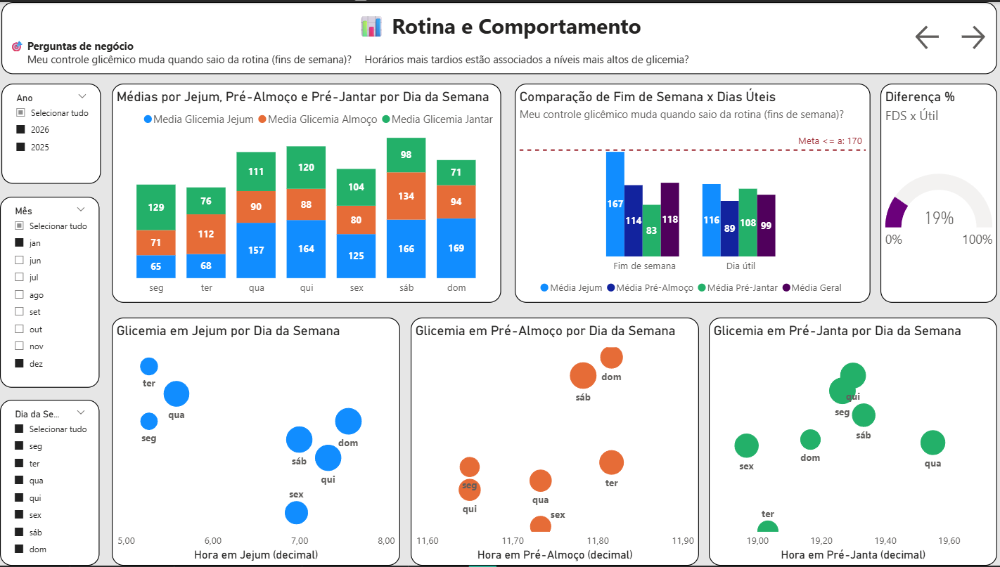
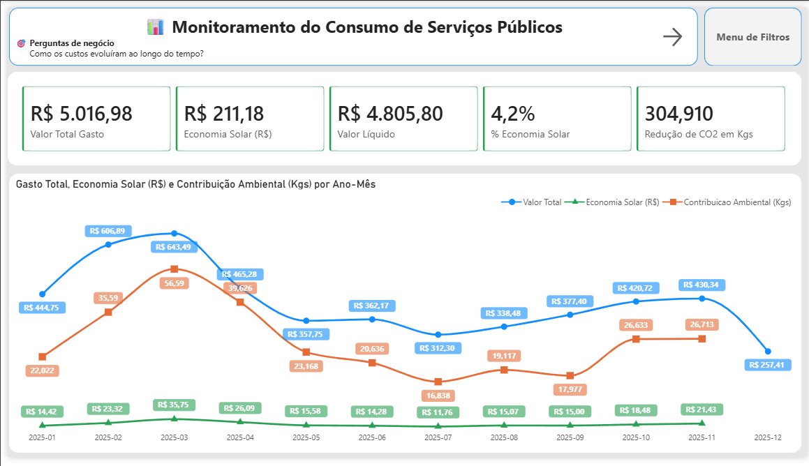
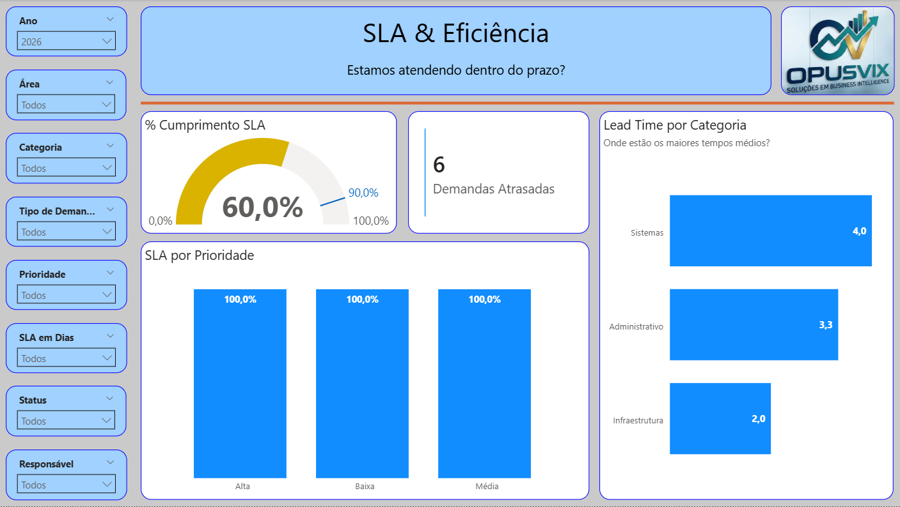

  <h1>Maurício Barros</h1>
  <h2>Analista de Dados focado em BI, Analytics e Tomada de Decisão</h2>
  <h2>Power BI • SQL • BigQuery • Modelagem Analítica • Dashboards Executivos</h2>

  

    Analista de Dados formado em Banco de Dados, com foco em
    <strong>Business Intelligence, Analytics e Engenharia de Dados</strong>.
    Desenvolvo dashboards, pipelines analíticos e modelos de dados
    que transformam dados em decisões de negócio.
  

  

    <a class="btn-primary" href="https://opusvix.github.io" target="_blank">Portfólio</a>
    <a class="btn-secondary" href="#projetos">Projetos</a>
    <a class="btn-secondary" href="https://github.com/opusvix" target="_blank">GitHub</a>
    <a class="btn-secondary" href="https://www.linkedin.com/in/mauriciodasilvabarros/" target="_blank">LinkedIn</a>
  

---

<section id="projetos">
  <h2 class="section-title">Projetos em Destaque</h2>

  

    

      
      <h3>📊 Monitoramento e Análise de Glicemia</h3>
      
Análise e visualização de indicadores glicêmicos para acompanhamento contínuo e apoio à tomada de decisão em saúde.

      

        Power BIPBIPAnalytics
      

      

        <a href="https://github.com/opusvix/glicemia-powerbi" target="_blank">GitHub</a>
        <a href="https://app.powerbi.com/links/mFMycL0Hza" target="_blank">Dashboard</a>
      

    

    

       
      <h3>⚡ Serviços Públicos & Energia Solar</h3>
      
Análise de consumo energético e economia financeira com foco em eficiência operacional e redução de custos.

      

        Power BIDAXPBIP
      

      

        <a href="https://github.com/opusvix/ServicosPublicos" target="_blank">GitHub</a>
        <a href="https://app.powerbi.com/links/szyB3ie72b" target="_blank">Dashboard</a>
      

    

    

      
      <h3>📈 Gestão de Demandas & SLA</h3>
      
Monitoramento de SLAs, produtividade e desempenho operacional para suporte à gestão de serviços.

      

        Power BISharePoint
      

      

        <a href="https://github.com/opusvix/gestao-demandas-sla-powerbi" target="_blank">GitHub</a>
        <a href="https://app.powerbi.com/links/V-rmi3jgC2" target="_blank">Dashboard</a>
      

    

    

      <h3>🧠 Suporte Operacional (Stack Google)</h3>
      
Pipeline analítico em stack Google para monitoramento operacional e visualização de indicadores em tempo quase real.

      

        BigQueryLookerGCP
      

      

        <a href="https://github.com/opusvix/SuporteOperacional-StackGoogle" target="_blank">GitHub</a>
        <a href="https://lookerstudio.google.com/s/sD-EnJFnXEU" target="_blank">Dashboard</a>
      

    

    

      <h3>🕸️ Streaming Graph Database (Neo4j)</h3>
      
Modelagem de dados em grafos para sistemas de recomendação, explorando relacionamentos e consultas em Cypher.

      

        Neo4jCypher
      

      

        <a href="https://github.com/opusvix/streaming-graph-database" target="_blank">GitHub</a>
      

    

    

      <h3>📊 Sales Forecast | Machine Learning</h3>
      
Previsão de vendas com Microsoft Fabric integrada a Warehouse e Power BI.

      

        FabricPower BI
      

      

        <a href="https://github.com/opusvix/sales-forecast-powerbi" target="_blank">GitHub</a>
        <a href="(https://app.powerbi.com/links/a69j1CByYs?ctid=da3d1810-8e7f-4c5c-a317-0ccb7ef62b3a&pbi_source=linkShare)" target="_blank">Dashboard</a>
      

    

  

</section>

## 🧠 Stack de Tecnologias
    
   - Python · SQL · Power BI · BigQuery · Looker Studio · GitHub · GCP · Fabric

## 🧠 Competências

- Análise Exploratória de Dados (EDA)

- SQL e Modelagem de Dados

- BI e Dashboards Executivos

- Automação de Processos Analíticos

- Storytelling com Dados   
 
## 🔗 Portfólio Técnico Completo
    
👉 Para detalhes técnicos, arquitetura, modelagem e código:
    
🔎 **GitHub README:** https://github.com/opusvix
        
## 🤝 Contato
    
   - 💼 LinkedIn: https://www.linkedin.com/in/mauriciodasilvabarros/
   - 🧑‍💻 GitHub: https://github.com/opusvix

"Dados bem analisados contam histórias melhores do que achismos."

